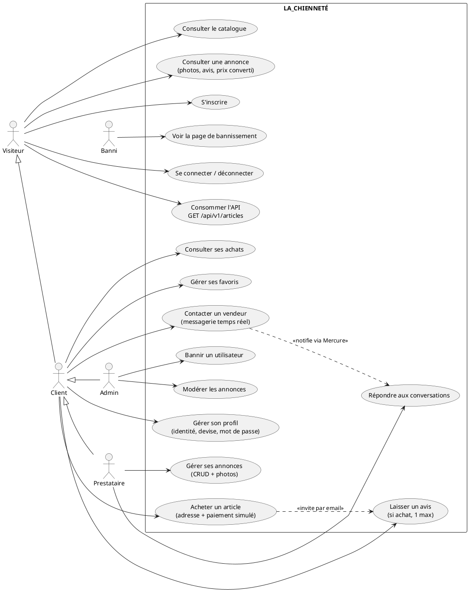

# Cahier des charges — LA_CHIENNETÉ

**Marketplace de vente entre particuliers et prestataires**

| | |
|---|---|
| Projet | Projet de fin de cycle Symfony |
| Application | LA_CHIENNETÉ — marketplace d'annonces |
| Version du document | 1.0 — 06/07/2026 |
| Stack | Symfony 8.0 (PHP ≥ 8.4), Doctrine ORM 3, PostgreSQL 16, AssetMapper + Stimulus + Turbo, Mercure, Messenger |
| Production | https://lachiennete.onrender.com (Render + Neon) |

---

## 1. Présentation du projet

### 1.1 Contexte

LA_CHIENNETÉ est une place de marché (marketplace) en ligne permettant à des vendeurs (« prestataires ») de publier des annonces d'articles, et à des clients de les consulter, les acheter, les commenter et échanger avec les vendeurs via une messagerie temps réel.

### 1.2 Objectifs

- Offrir un **catalogue public** d'annonces consultable sans compte, organisé par catégories et tags.
- Permettre aux **vendeurs** de gérer intégralement leurs annonces (création, édition, suppression, photos).
- Offrir aux **acheteurs** un parcours d'achat complet : consultation, mise en favoris, achat avec adresse de livraison, confirmation par email, historique, dépôt d'avis.
- Mettre en relation acheteurs et vendeurs par une **messagerie instantanée** (temps réel via Mercure).
- Fournir une **administration** de modération (suppression d'annonces, bannissement d'utilisateurs).
- Exposer une **API REST** publique du catalogue.
- Afficher les prix dans la **devise choisie par l'utilisateur** (conversion via une API de taux de change externe).

### 1.3 Périmètre

**Inclus** : catalogue, comptes utilisateurs, gestion d'annonces, achat (paiement simulé), avis, favoris, messagerie temps réel, administration, API de consultation, emails transactionnels asynchrones, multi-devises.

**Exclus (hors périmètre)** : paiement réel (aucun débit n'est effectué — le paiement est une simulation pédagogique), livraison/logistique réelle, facturation (TVA), remboursements, recherche full-text.

---

## 2. Acteurs et rôles

### 2.1 Hiérarchie des rôles

```
ROLE_SUPER_ADMIN
└── ROLE_ADMIN
    ├── ROLE_SERVICE_CLIENT
    ├── ROLE_PREPARATEUR_COMMANDE
    ├── ROLE_PRESTATAIRE ─┐
    ├── ROLE_CLIENT ──────┤
    ├── ROLE_BANNI ───────┼── ROLE_USER
    └── ROLE_VIP ─────────┘
```

Tous les rôles applicatifs héritent de `ROLE_USER`. `ROLE_ADMIN` hérite de l'ensemble des rôles métier ; `ROLE_SUPER_ADMIN` hérite de `ROLE_ADMIN`.

### 2.2 Description des acteurs

| Acteur | Rôle | Capacités |
|---|---|---|
| **Visiteur** | *(non connecté)* | Consulte l'accueil et les fiches d'annonces, s'inscrit, se connecte, consomme l'API publique. |
| **Client** | `ROLE_CLIENT` | Tout ce que fait le visiteur + achète des articles, gère ses favoris, contacte les vendeurs, laisse des avis sur ses achats, gère son profil (identité, devise, mot de passe), consulte son historique d'achats. Rôle attribué par défaut à l'inscription. |
| **Prestataire (vendeur)** | `ROLE_PRESTATAIRE` | Tout ce que fait le client + gère ses annonces dans l'espace vendeur `/my-articles` : création, édition, suppression, upload et suppression de photos. Répond aux conversations sur ses annonces. |
| **Administrateur** | `ROLE_ADMIN` | Accède au back-office `/admin` : tableau de bord, liste et suppression de n'importe quelle annonce, liste des utilisateurs, bannissement. |
| **Super administrateur** | `ROLE_SUPER_ADMIN` | Réservé aux évolutions (gestion des admins). |
| **Utilisateur banni** | `ROLE_BANNI` | Ne peut plus accéder à aucune page du site : toute requête est redirigée vers la page de bannissement (seule la déconnexion reste possible). |
| **Rôles réservés** | `ROLE_VIP`, `ROLE_SERVICE_CLIENT`, `ROLE_PREPARATEUR_COMMANDE` | Présents dans la hiérarchie pour les évolutions futures (avantages VIP, support, préparation de commandes). |

### 2.3 Comptes de test

Tous les comptes de fixtures ont le mot de passe `password` (liste complète dans le `README.md`) :

- **Admin** : `admin@snapdeals.fr`
- **Prestataires** : `thomas.lefevre@gmail.com`, `camille.roussel@outlook.fr`, `nicolas.garnier@hotmail.fr`
- **Clients** : `julien.moreau@gmail.com`, `emma.petit@gmail.com`, … (9 comptes)
- **Banni** : aucun par défaut — bannir un compte depuis `/admin/users` pour tester.

---

## 3. Description fonctionnelle

### 3.1 Module Catalogue (public)

| Réf. | Fonctionnalité | Détail |
|---|---|---|
| CAT-01 | Page d'accueil | Liste de toutes les annonces (plus récentes en premier) avec photo principale, prix converti, catégorie ; liste des catégories triées par nom. Route `/`. |
| CAT-02 | Fiche annonce | Détail d'une annonce : photos ordonnées, description, prix (ou mention « sur devis »), tags, vendeur, avis avec note moyenne. Route `/article/{id}`. |
| CAT-03 | Article sans prix | Une annonce peut ne pas avoir de prix ; elle affiche alors son **moyen de paiement alternatif** (ex. troc) et n'est pas achetable en ligne — l'acheteur doit contacter le vendeur. |
| CAT-04 | Multi-devises | Tous les prix (stockés en EUR) sont affichés dans la devise de l'utilisateur connecté via le filtre Twig `price` : EUR, USD, GBP, CHF, CAD, JPY. Taux fournis par l'API externe **Frankfurter** (BCE), mis en cache 1 h, repli EUR si indisponible. |

### 3.2 Module Comptes utilisateurs

| Réf. | Fonctionnalité | Détail |
|---|---|---|
| CPT-01 | Inscription | Formulaire prénom / nom / email / mot de passe (double saisie, min. 6 caractères). Le compte reçoit `ROLE_CLIENT`. Route `/register`. |
| CPT-02 | Connexion | `form_login` Symfony, identifiant = email, protection CSRF, messages en français. Route `/login`. |
| CPT-03 | Déconnexion | Route `/logout`. |
| CPT-04 | Profil | Modification de prénom, nom, email et **devise d'affichage** (liste issue de `CurrencyConverter::choices()`). Route `/profile`. |
| CPT-05 | Changement de mot de passe | Formulaire dédié sur la page profil, nouveau mot de passe hashé (`auto`). |
| CPT-06 | Bannissement | Un utilisateur `ROLE_BANNI` est intercepté par un listener (`kernel.request`) et redirigé vers `/banned` quelle que soit la page demandée. |

### 3.3 Module Vente (espace prestataire)

Espace réservé `ROLE_PRESTATAIRE`, préfixe `/my-articles`.

| Réf. | Fonctionnalité | Détail |
|---|---|---|
| VTE-01 | Mes annonces | Liste des annonces du vendeur connecté avec statut (en vente / épuisé). |
| VTE-02 | Créer une annonce | Titre, description, prix **ou** paiement alternatif, quantité, catégorie, tags (multi-sélection), photos multiples. |
| VTE-03 | Modifier une annonce | Même formulaire ; réservé au propriétaire via le voter `ArticleVoter` (`ARTICLE_EDIT`). |
| VTE-04 | Supprimer une annonce | Suppression avec les photos associées (fichiers effacés du disque). Protégée par CSRF + voter. |
| VTE-05 | Gérer les photos | Upload multiple (fichiers renommés `slug-uniqid.ext`), ordre par `position`, suppression photo par photo. |

### 3.4 Module Achat

| Réf. | Fonctionnalité | Détail |
|---|---|---|
| ACH-01 | Checkout | Page `/checkout/{id}` : choix d'une adresse de livraison existante **ou** saisie d'une nouvelle adresse (validée puis ajoutée au carnet du client), saisie d'une carte bancaire fictive. Paiement **simulé** — aucun débit réel. |
| ACH-02 | Garde-fous | Achat refusé si : article épuisé, article sans prix (sur devis), ou tentative d'achat de sa propre annonce. |
| ACH-03 | Enregistrement | La commande (`Purchase`) est un **snapshot** : titre, prix et adresse sont copiés au moment de l'achat afin de survivre à la suppression de l'annonce (`ON DELETE SET NULL`). Le stock (`quantity`) est décrémenté ; à 0 l'article passe « épuisé » (`soldAt`). |
| ACH-04 | Emails | Deux emails asynchrones (Messenger, transport `async`) : confirmation de commande et invitation à laisser un avis (lien direct vers le formulaire). En dev, capturés par Mailpit. |
| ACH-05 | Confirmation | Page de confirmation accessible uniquement à l'acheteur. |
| ACH-06 | Historique | Page `/purchases` : liste des achats du client avec indication des articles déjà évalués. |

### 3.5 Module Avis

| Réf. | Fonctionnalité | Détail |
|---|---|---|
| AVI-01 | Dépôt d'avis | Note de 1 à 5 + commentaire facultatif, via `/articles/{id}/review`. |
| AVI-02 | Conditions | Réservé aux utilisateurs ayant **réellement acheté** l'article ; **un seul avis** par acheteur et par article. |
| AVI-03 | Affichage | Avis et note moyenne visibles sur la fiche annonce. |

### 3.6 Module Favoris

| Réf. | Fonctionnalité | Détail |
|---|---|---|
| FAV-01 | Ajout / retrait | Bouton cœur sur les annonces (toggle), réservé `ROLE_CLIENT`, mise à jour sans rechargement via Turbo Stream. |
| FAV-02 | Mes favoris | Page `/favorites` listant les annonces mises en favori. |

### 3.7 Module Messagerie (temps réel)

| Réf. | Fonctionnalité | Détail |
|---|---|---|
| MSG-01 | Ouvrir une conversation | Bouton « Contacter le vendeur » sur la fiche annonce ; une conversation est unique par couple (annonce, acheteur) ; interdit sur sa propre annonce. |
| MSG-02 | Mes conversations | Liste des conversations (acheteur ou vendeur) avec compteur de messages **non lus** par conversation. |
| MSG-03 | Fil de discussion | Accès restreint aux deux participants via le voter `ConversationVoter` (`CONVERSATION_VIEW`). L'ouverture marque les messages reçus comme lus. |
| MSG-04 | Temps réel | Chaque message est publié sur le hub **Mercure** (topic privé `/conversations/{id}`) et injecté dans la page de l'interlocuteur en **Turbo Stream**, sans rechargement. Si le hub est indisponible, l'envoi fonctionne quand même (dégradation gracieuse). |

### 3.8 Module Administration

Back-office réservé `ROLE_ADMIN`, préfixe `/admin`.

| Réf. | Fonctionnalité | Détail |
|---|---|---|
| ADM-01 | Tableau de bord | Compteurs globaux (annonces, utilisateurs…). |
| ADM-02 | Modération des annonces | Liste de toutes les annonces, suppression (CSRF). |
| ADM-03 | Gestion des utilisateurs | Liste de tous les comptes, **bannissement** (attribution de `ROLE_BANNI`). |

### 3.9 API REST

| Réf. | Fonctionnalité | Détail |
|---|---|---|
| API-01 | Catalogue | `GET /api/v1/articles` : liste JSON de toutes les annonces (titre, prix, catégorie, tags, images, vendeur). Sérialisation par groupe `article:list` — **email et mot de passe du vendeur exclus**. Public, sans authentification. |

### 3.10 Emails transactionnels

| Email | Déclencheur | Template |
|---|---|---|
| Confirmation de commande | Achat validé | `emails/purchase_confirmation.html.twig` |
| Demande d'avis | Achat validé | `emails/review_request.html.twig` |

Expéditeur : `no-reply@la-chiennete.onion` (« LA_CHIENNETÉ »). Envoi **asynchrone** : les messages `SendEmailMessage` sont routés vers le transport `async` de Messenger et consommés par un worker dédié (conteneur `messenger-worker`) ; transport `failed` (Doctrine) pour les échecs.

---

## 4. Cas d'utilisation

### 4.1 Diagramme (PlantUML)



### 4.2 Cas d'utilisation détaillés (principaux scénarios)

#### UC-A — Acheter un article

| | |
|---|---|
| Acteur | Client (connecté) |
| Précondition | Annonce en stock, avec un prix, publiée par un autre utilisateur |
| Scénario nominal | 1. Le client ouvre la fiche annonce et clique « Acheter ». 2. Il choisit une adresse de livraison existante ou en saisit une nouvelle (validée puis ajoutée à son carnet). 3. Il saisit une carte fictive et valide (CSRF). 4. Le système crée la commande (snapshot titre/prix/adresse), décrémente le stock, envoie 2 emails asynchrones (confirmation + demande d'avis). 5. Le client est redirigé vers la page de confirmation. |
| Alternatives | 2a. Adresse invalide → erreurs affichées, formulaire re-présenté. |
| Exceptions | Article épuisé, sans prix, ou propre annonce → redirection fiche annonce avec message d'erreur. |
| Postcondition | `Purchase` créé ; stock décrémenté ; article « épuisé » si stock = 0. |

#### UC-B — Publier une annonce

| | |
|---|---|
| Acteur | Prestataire |
| Précondition | Connecté avec `ROLE_PRESTATAIRE` |
| Scénario nominal | 1. Le vendeur ouvre `/my-articles/new`. 2. Il renseigne titre, description, catégorie, tags, quantité, photos. 3. Il indique un prix **ou** un moyen de paiement alternatif. 4. Le système valide (règle métier RG-02), enregistre les photos renommées, publie l'annonce. |
| Exceptions | Ni prix ni paiement alternatif → violation de validation, formulaire re-présenté. |
| Postcondition | Annonce visible sur l'accueil et via l'API. |

#### UC-C — Laisser un avis

| | |
|---|---|
| Acteur | Client |
| Précondition | A acheté l'article ; n'a pas encore laissé d'avis dessus |
| Scénario nominal | 1. Depuis l'email de demande d'avis ou son historique d'achats, le client ouvre le formulaire. 2. Il note de 1 à 5, commente (facultatif), valide. 3. L'avis apparaît sur la fiche annonce. |
| Exceptions | Non-acheteur ou avis déjà déposé → redirection avec message d'erreur. |

#### UC-D — Échanger avec un vendeur

| | |
|---|---|
| Acteurs | Client (acheteur) et Prestataire (vendeur) |
| Précondition | Connectés ; l'acheteur n'est pas le vendeur de l'annonce |
| Scénario nominal | 1. L'acheteur clique « Contacter » sur l'annonce ; la conversation est créée (ou rouverte si elle existe). 2. Chaque participant envoie des messages via le formulaire. 3. Chaque message est poussé en temps réel chez l'interlocuteur (Mercure + Turbo Stream) et marqué non lu tant que la conversation n'est pas ouverte. |
| Sécurité | Seuls les 2 participants accèdent au fil (`ConversationVoter`). |
| Dégradation | Hub Mercure indisponible → le message est quand même enregistré, visible au rechargement. |

#### UC-E — Bannir un utilisateur

| | |
|---|---|
| Acteur | Administrateur |
| Scénario nominal | 1. L'admin ouvre `/admin/users`. 2. Il clique « Bannir » sur un compte (CSRF). 3. Le compte reçoit `ROLE_BANNI`. 4. À sa prochaine requête, l'utilisateur banni est redirigé vers `/banned` (seule la déconnexion reste accessible). |

---

## 5. Règles métier

| Réf. | Règle |
|---|---|
| RG-01 | Un compte créé via l'inscription reçoit `ROLE_CLIENT`. Les rôles supérieurs sont attribués manuellement (fixtures / évolution admin). |
| RG-02 | Une annonce doit avoir **un prix OU un moyen de paiement alternatif** (validation croisée `#[Assert\Callback]` sur l'entité `Article`). |
| RG-03 | Une annonce sans prix (« sur devis ») **n'est pas achetable en ligne** : l'acheteur passe par la messagerie. |
| RG-04 | Un utilisateur ne peut ni acheter ni contacter **sa propre annonce**. |
| RG-05 | L'achat décrémente la quantité ; à 0, l'annonce est **épuisée** (`soldAt` renseigné) et n'est plus achetable. |
| RG-06 | La commande conserve un **snapshot** (titre, prix, adresse aplatie) indépendant de l'annonce d'origine. |
| RG-07 | Seul un **acheteur effectif** peut déposer un avis, **un seul** par article, note entière de 1 à 5. |
| RG-08 | Seul le **propriétaire** d'une annonce peut la modifier/supprimer (`ArticleVoter`) ; l'admin peut supprimer toute annonce depuis le back-office. |
| RG-09 | Une conversation est **unique** par couple (annonce, acheteur) et n'est visible que par ses 2 participants (`ConversationVoter`). |
| RG-10 | Un utilisateur `ROLE_BANNI` n'accède à aucune page hors `/banned` et `/logout` (listener `kernel.request`). |
| RG-11 | Les prix sont **stockés en EUR** ; la conversion (6 devises) est purement d'affichage, avec repli EUR si l'API de taux est indisponible. |
| RG-12 | Une adresse saisie au checkout est **validée** puis ajoutée au carnet d'adresses du client (réutilisable). |
| RG-13 | Le paiement est **simulé** : seuls les 4 derniers chiffres de la carte sont conservés dans une note ; aucun débit réel. |

---

## 6. Modèle de données

Le schéma complet (12 entités, attributs, cardinalités) est maintenu dans **`docs/database.puml`** (diagramme de classes UML — PlantUML).

Synthèse :

- **User** (`app_user`) — comptes ; devise d'affichage ; rôles en JSON.
- **Article** — annonce d'un vendeur, rattachée à une **Category**, taguée (**Tag**, ManyToMany `article_tag`), illustrée (**Image**, ordonnées par `position`).
- **Purchase** — achat snapshot (titre/prix/adresse copiés), lien article en `SET NULL`.
- **Review** — avis 1–5 d'un acheteur sur un article.
- **Conversation / Message** — messagerie par annonce et par acheteur, statut lu/non-lu.
- **Address** — héritage **Single Table** (discriminateur `type`) → `ShippingAddress` / `BillingAddress` ; carnet d'adresses par utilisateur.
- **Favoris** — ManyToMany `User ↔ Article` (table `user_favorite`).

Points structurants : 10 entités mappées (+ 2 tables de jointure), héritage STI, 2 ManyToMany, timestamps immutables initialisés dans les constructeurs, table `app_user` (le nom `user` est réservé en PostgreSQL).

---

## 7. Exigences non fonctionnelles

### 7.1 Sécurité

- Authentification `form_login` + **CSRF** sur le login et sur toutes les actions sensibles (achat, suppression, ban, contact).
- Mots de passe hashés (`auto` — bcrypt/argon selon plateforme).
- Autorisations à 3 niveaux : hiérarchie de rôles, `#[IsGranted]` sur les contrôleurs, **2 voters** métier (`ArticleVoter`, `ConversationVoter`).
- `access_control` : `/profile` réservé `ROLE_USER`.
- API : exclusion explicite des données sensibles (email, mot de passe) via les groupes de sérialisation.
- Topics Mercure **privés** (JWT) pour la messagerie.

### 7.2 Performance

- Requêtes catalogue et messagerie optimisées au `QueryBuilder` avec jointures `addSelect` (prévention N+1).
- Taux de change mis en **cache 1 h**.
- API Platform configuré **stateless**.

### 7.3 Expérience utilisateur

- Interface **entièrement en français** (UI, messages de validation, emails) ; URLs techniques en anglais.
- Interactions sans rechargement (Turbo Streams : favoris, messagerie).
- Messagerie **temps réel** (< 1 s) via Mercure, avec dégradation gracieuse.
- Frontend sans étape de build Node (AssetMapper + importmap), Tailwind CSS.

### 7.4 Fiabilité

- Envoi d'emails **asynchrone** (l'achat n'échoue pas si le SMTP est lent), transport `failed` pour rejouer les échecs.
- Repli EUR si l'API de change est indisponible ; enregistrement des messages même si Mercure est down.
- Migrations Doctrine versionnées, appliquées automatiquement au démarrage des conteneurs.

---

## 8. Architecture technique

### 8.1 Stack

| Couche | Technologie |
|---|---|
| Langage / framework | PHP ≥ 8.4, Symfony 8.0 |
| ORM | Doctrine ORM 3 + migrations |
| Base de données | PostgreSQL 16 |
| API | API Platform 4 (stateless) + contrôleur API dédié |
| Frontend | Twig, AssetMapper (importmap), Stimulus, Turbo, Tailwind CSS |
| Temps réel | Mercure (hub dédié, JWT) |
| Asynchrone | Symfony Messenger (transport `async`, worker dédié ; `failed` sur Doctrine) |
| Emails | Symfony Mailer (Mailpit en dev) |
| HTTP externe | Symfony HttpClient → API Frankfurter (taux BCE) |
| Tests | PHPUnit 12 (`.env.test`, base `app_test`) |

### 8.2 Environnement de développement (Docker Compose)

| Conteneur | Rôle | Accès |
|---|---|---|
| `php` | Serveur PHP built-in | http://localhost:8089 |
| `database` | PostgreSQL 16 | hôte : port 5439 |
| `adminer` | UI base de données | http://localhost:8088 |
| `mailer` | Mailpit (capture des emails) | http://localhost:8025 |
| `mercure` | Hub temps réel | http://localhost:8090/.well-known/mercure |
| `messenger-worker` | Consommation de la file `async` | — |

Orchestration via `Makefile` (`make install`, `make up`, `make sh`…). L'entrypoint installe les dépendances, chauffe le cache et applique les migrations automatiquement.

### 8.3 Production

- Hébergement : **Render** (conteneur Docker, branche `prod` : `render.yaml`, `Dockerfile`, `docker/entrypoint.prod.sh`).
- Base de données : **Neon** (PostgreSQL managé).
- Secrets (`DATABASE_URL`, `APP_SECRET`…) configurés dans le dashboard Render.
- URL : https://lachiennete.onrender.com

---

## 9. Qualité et tests

- **Test unitaire** : `tests/Unit/Service/CurrencyConverterTest.php` — service de conversion isolé (`MockHttpClient`, cache mémoire) : fallback EUR, conversion, mise en cache, erreurs API.
- **Test fonctionnel** : `tests/Functional/Controller/Api/ArticleApiControllerTest.php` — `WebTestCase` sur `GET /api/v1/articles` contre la base `app_test` : statut, contenu JSON, non-exposition du mot de passe.
- Exécution : `docker compose exec php vendor/bin/phpunit`.
- **Fixtures** : 6 classes ordonnées (`getDependencies()`) fournissant un jeu de données complet (comptes par rôle, annonces, achats, avis, conversations).
- À venir : pipeline CI (lint Symfony + PHPStan ≥ niveau 5 + tests à chaque push).

---

## 10. Livrables

| Livrable | Emplacement |
|---|---|
| Code source | Dépôt Git (branche `main` ; branche `prod` pour le déploiement) |
| Guide d'installation + comptes de test | `README.md` |
| Cahier des charges | `docs/cahier-des-charges.md` (ce document) |
| Schéma de base de données (UML) | `docs/database.puml` |
| Application en ligne | https://lachiennete.onrender.com |
